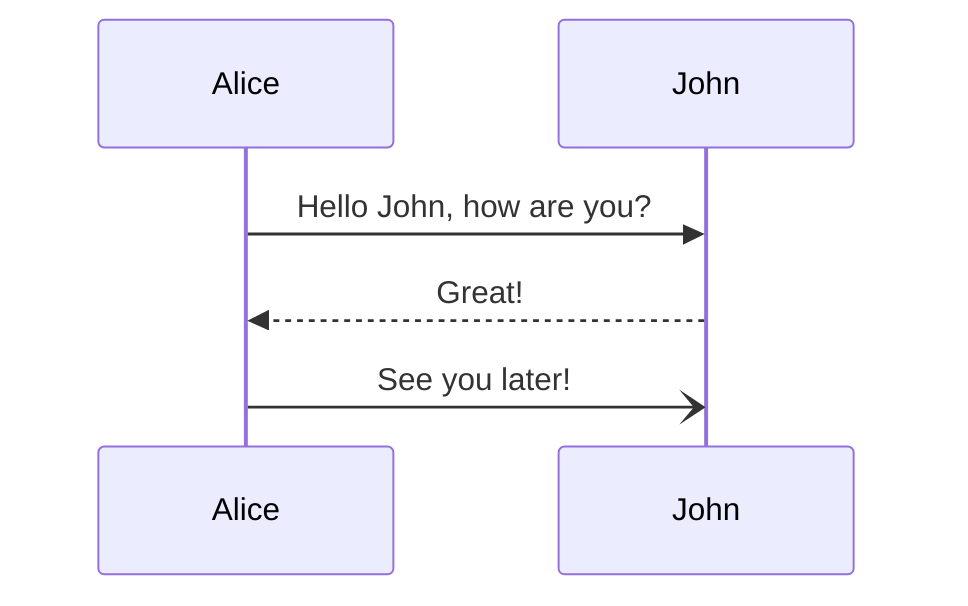
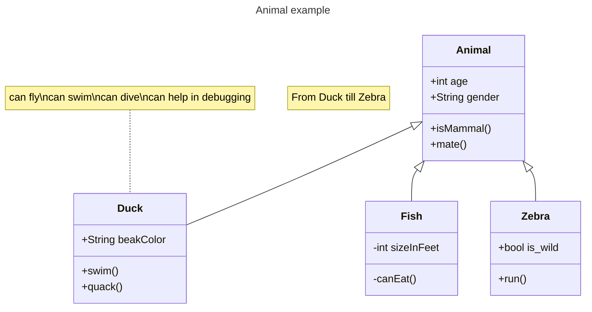
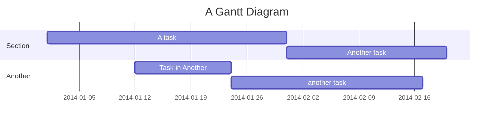
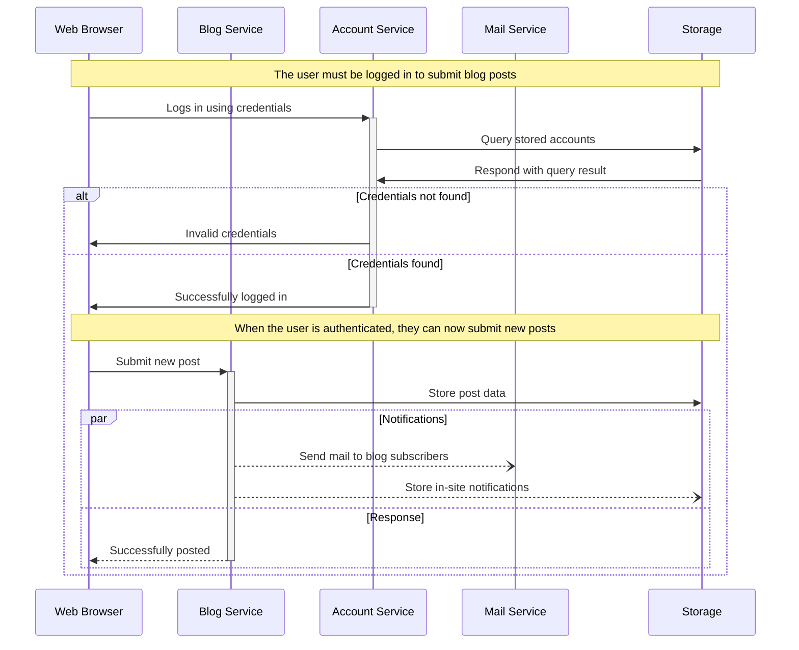

```mermaid
graph TD;
    A-->B;
    A-->C;
    B-->D;
    C-->D;
```

```mermaid
sequenceDiagram
    Alice->>John: Hello John, how are you?
    John-->>Alice: Great!
    Alice-)John: See you later!
```

```mermaid
---
title: Animal example
---
classDiagram
    note "From Duck till Zebra"
    Animal <|-- Duck
    note for Duck "can fly\ncan swim\ncan dive\ncan help in debugging"
    Animal <|-- Fish
    Animal <|-- Zebra
    Animal : +int age
    Animal : +String gender
    Animal: +isMammal()
    Animal: +mate()
    class Duck{
        +String beakColor
        +swim()
        +quack()
    }
    class Fish{
        -int sizeInFeet
        -canEat()
    }
    class Zebra{
        +bool is_wild
        +run()
    }
```

```mermaid
gantt
    title A Gantt Diagram
    dateFormat YYYY-MM-DD
    section Section
        A task          :a1, 2014-01-01, 30d
        Another task    :after a1, 20d
    section Another
        Task in Another :2014-01-12, 12d
        another task    :24d
```

```mermaid
sequenceDiagram
    participant web as Web Browser
    participant blog as Blog Service
    participant account as Account Service
    participant mail as Mail Service
    participant db as Storage

    Note over web,db: The user must be logged in to submit blog posts
    web->>+account: Logs in using credentials
    account->>db: Query stored accounts
    db->>account: Respond with query result

    alt Credentials not found
        account->>web: Invalid credentials
    else Credentials found
        account->>-web: Successfully logged in

        Note over web,db: When the user is authenticated, they can now submit new posts
        web->>+blog: Submit new post
        blog->>db: Store post data

        par Notifications
            blog--)mail: Send mail to blog subscribers
            blog--)db: Store in-site notifications
        and Response
            blog-->>-web: Successfully posted
        end
    end
```
